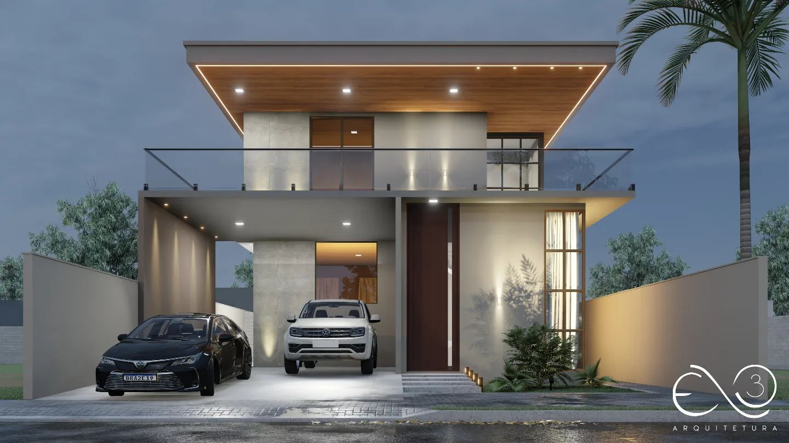

# Elo3 Arquitetura - Soluções em Arquitetura(projeto atividade 3)

## Descrição

Este projeto consiste em uma página web simples desenvolvida com **HTML** e **CSS**, seguindo os requisitos propostos. O objetivo foi construir a estrutura básica de um site contendo **header**, **section**, **aside** e **footer**, além de aplicar estilizações com **CSS** e organizar o layout de forma responsiva.

<p align="center">
  
</p>

## Estrutura do Projeto

A página possui a seguinte estrutura:

- **Header:** Inclui o título do site e um menu de navegação com 3 links fictícios.
- **Section:** Contém o conteúdo principal do site, com um parágrafo explicativo e uma imagem com o atributo `alt` corretamente preenchido.
- **Aside:** Apresenta uma lista de links externos relacionados ao tema.
- **Footer:** Exibe as informações de direitos autorais.

## Tecnologias Utilizadas

- **HTML5**
- **CSS3**
- **Google Fonts** (Fonte: [Roboto](https://fonts.google.com/specimen/Roboto))
- **Bootstrap 5**
- **Font Awesome**

## Layout e Estilização

- O layout foi construído com **duas colunas**, onde o **section** ocupa 70% da largura da página e o **aside** 30%.
- As cores de fundo foram aplicadas em todas as seções do site (header, section, aside, footer).
- Texto centralizado no header e no footer.
- Efeitos de **hover** foram aplicados aos links do menu de navegação e aos links do aside.
  
### Paleta de Cores:

- **Header e Footer:** #2c3e50 (escuro) e #34495e (alternativo)
- **Section:** #ecf0f1 (claro)
- **Aside:** #bdc3c7 (neutro)

<p align="center">
  
</p>

## Como Executar o Projeto

1. Clone este repositório:
   ```bash
   git clone https://github.com/seu-usuario/elo3-arquitetura.git
   ```


2. Acesse o diretório do projeto:
   ```bash
   cd elo3-arquitetura
   ```

3. Abra o arquivo `index.html` diretamente no seu navegador, ou utilize uma extensão como **Live Server** no VSCode.

## Deploy

O projeto está disponível online no seguinte link:
- [Visualizar página](https://atividade-03.vercel.app/)

## Imagens do Projeto

A seguir estão algumas capturas de tela do site:

### Home:
<p align="center">
  
</p>

### Projetos:
<p align="center">
  
</p>

## Licença

Este projeto está licenciado sob a [Licença MIT](LICENSE).

```
Esse `README.md` fornece uma descrição detalhada do projeto, a estrutura da página, as tecnologias usadas e instruções para executar o projeto localmente, além de imagens ilustrativas e o link para o deploy. A inclusão das imagens pode ajudar na visualização do conteúdo e na apresentação geral do projeto.
```
